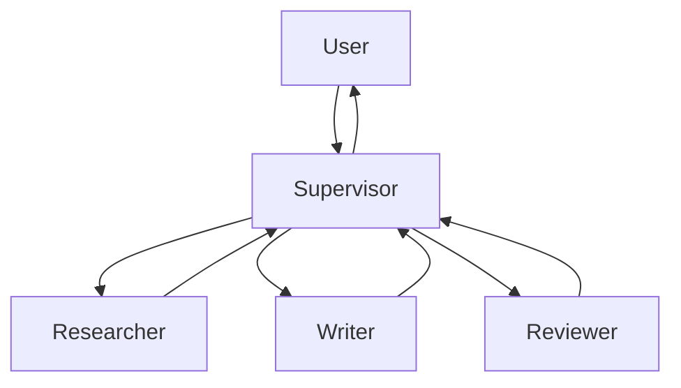

Sample LangGraph
---

This is a sample of [LangGraph](https://python.langchain.com/docs/langgraph), a library for building stateful Multi-Actor applications using LLM and LangChain.

## Description

This is a sample for generating blogs using [LangGraph](https://python.langchain.com/docs/langgraph).  
The structure is as follows:

## Used tools

| tools | description |
| --- | --- |
| [LangGraph](https://python.langchain.com/docs/langgraph) | library for building stateful, multi-actor applications with LLMs |
| [LangChain](https://python.langchain.com/docs/get_started/introduction) | framework for developing applications powered by language models |
| [OpenAI API](https://openai.com/blog/openai-api) | API for accessing new AI models developed by OpenAI |
| [SerpAPI](https://serpapi.com/) | API for fast, easy, and complete scraping from Google and other search engines |

## Usage

Open the `.ipynb` file in [Google Colab](https://colab.google/) and follow the instructions.

**NOTE: OpenAI API and SerpAPI keys must be set to `secret`.**
